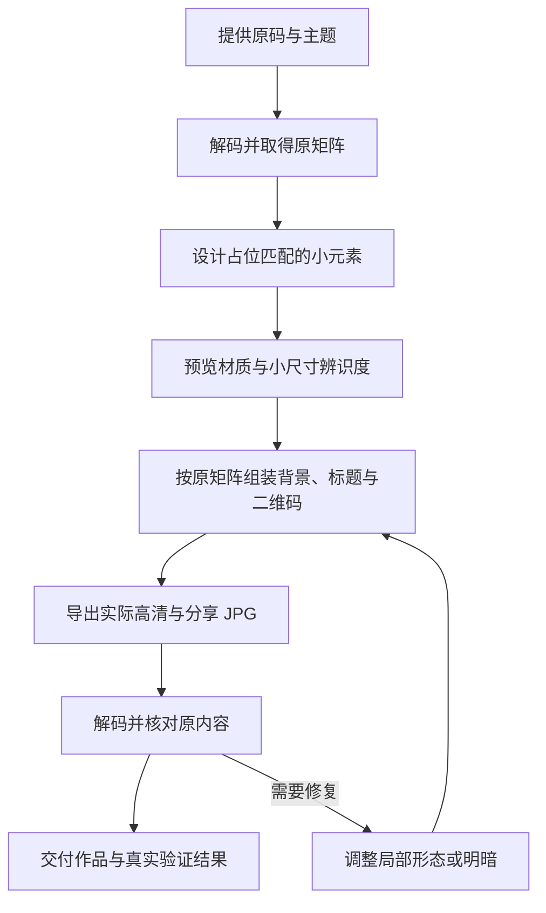

# Artistic QR Skill · 艺术化二维码

将普通二维码设计为具有主题、材质和物件细节的艺术海报，同时保留原码内容，并验证最终导出的扫码结果。

A reusable agent skill for themed QR artwork: design recognizable assets, compose them against the original QR matrix, and validate the actual exported poster.

**核心流程：确定主题与小元素 → 按原码组装 → 检测实际成品 → 必要的局部修复。**

## 这份 Skill 提供什么

这是一个以 `SKILL.md` 为入口的流程型 Agent Skill，适合 Codex 或能够读取该格式的助手。它提供制作步骤、元素设计约束、few-shot、交付规则和解码验收方法；执行时由助手结合可用的图像生成工具、排版环境和二维码解码器完成作品。

当前仓库提供的是可复用的制作方法，没有打包完整的一键生成程序、模型权重或平台专用二进制。使用者需要提供原码，执行环境需要具备实际生成和检测能力。

适合以下任务：

- 将普通二维码设计为服饰、开业、节庆等主题的物件组合。
- 只设计独立小元素，先确认风格，再生成完整海报。
- 用纽扣、礼盒等物件尝试替代主定位造型。
- 调整金属、丝绸、针织的明暗与光泽，同时检查扫码表现。
- 在已经确认的海报上修整局部细节，保留其他版式。

## 为什么把生成与组装分开

通用图像模型可能在重画二维码时改变格点，外观相似也不代表能读出正确内容。因此，本流程让图像工具负责物件和背景，让确定性排版负责二维码的位置与组合。



主定位和辅助校正需要单独适配。一个礼盒元素看起来合理，或在简洁测试码中通过，都不能替代完整海报的实际检测。

## 安装

将仓库克隆到 Codex 的技能目录，文件夹命名为 `artistic-qr`：

```bash
mkdir -p "${CODEX_HOME:-$HOME/.codex}/skills"
git clone https://github.com/Cream-yj/artistic-qr-skill.git \
  "${CODEX_HOME:-$HOME/.codex}/skills/artistic-qr"
```

在能加载此 Skill 的会话中使用 `$artistic-qr`。如果当前客户端没有识别它，可以直接给助手提供安装目录中的 `SKILL.md` 路径。其他支持技能文件的工具，也可以按各自的技能目录规则放置这份仓库。

本仓库的 Skill 安装不包含图像模型、Python/Node 库或系统框架的安装；这些执行能力由当前环境提供。

## 使用示例

### 先做小元素

```text
使用 $artistic-qr，根据我提供的二维码设计一套轻奢女装小元素。
希望有莓红、钴蓝、祖母绿等颜色差异，保留织物质感。
弯折尝试直角短袜，先提供独立 SVG 和小尺寸预览，暂不做大海报。
```

### 组装完整海报

```text
使用 $artistic-qr，把提供的原码做成“开业大吉”主题海报。
使用元宝、金条、红包和剪彩元素；希望保留明亮的黄金光泽。
先确认元素和底图，再组装完整二维码。
交付高清 JPG 和适合数字分享的 JPG，检测实际文件并核对扫码内容。
```

### 修改已经确认的作品

```text
使用 $artistic-qr，只修整这张海报里礼炮的彩带和元宝上的伪文字。
保留现有标题、背景、二维码位置及其他元素。
修改后重新检测最终 JPG，并说明扫码结果是否发生变化。
```

可以一次要求完整制作，也可以只要求某个阶段。Skill 按本次请求推进，已确认的风格和素材会继续沿用。

## 建议提供的输入

| 输入 | 作用 |
| --- | --- |
| 原始二维码 SVG 或清晰图片 | 确认实际内容，取得用于组装的矩阵 |
| 主题与风格 | 确定物件、材质和配色 |
| 参考图，可选 | 帮助统一质感、定位造型及构图 |
| 标题/店名等准确文字，可选 | 避免模型自行补写信息 |
| 发布场景与目标尺寸 | 确定模块在成品中的大小及应测条件 |
| SVG 类型偏好 | 选择纯矢量，或保留照片质感的内嵌图片 SVG |

原码能够解出内容，不等于已经恢复了同一矩阵。若无法可靠取得原矩阵，助手应说明缺口；重编码、换短链或提高纠错等级需要符合使用者的明确选择。

## 两阶段制作

### 1. 主题与元素

先分析实际占位，再选择物件。例如：

| 暗格组合 | 服饰主题示例 | 开业主题示例 |
| --- | --- | --- |
| 单点 | 包布纽扣 | 小金币 |
| 横向短块/长块 | 蝴蝶结、腰带 | 元宝、金条 |
| 竖块 | 吊牌 | 红包、礼花筒 |
| 满矩形 | 针织上衣 | 叠放金条 |
| 三格弯折 | 直角短袜 | 弯折剪彩带 |
| 主定位 | 织物纽扣或框 | 打开的礼盒 |

表中是可选映射，不要求每张码都有同样数量或类型的元素。设计时同时看放大细节与实际入码尺寸，保证缩小后仍能认出物件。

### 2. 组装、适配与验证

保留原矩阵与功能区域，按格点放置素材，并保留四个模块宽的静区。背景、标题、二维码和说明文字独立处理，方便后续小范围修改。

光泽并非一定要去掉。优先调整高光的位置与面积、关键深色面的明度以及物件厚度，保持已选色相和材质；每次影响二维码的改变都检测对应的新成品。

## 交付格式

| 内容 | 形式 |
| --- | --- |
| 选定小元素 | 每件独立、自包含 SVG，记录占位与方向 |
| 完整海报 | 整体高清 JPG |
| 数字分享 | 按主要使用尺寸导出并检测的 JPG |
| 工作母版 | 无损图片、透明原素材、组合源，保留在本地 |
| 验码记录 | 实际文件、散列、读取内容、配置与逐项结果 |

**SVG 有两种形式：**

- **纯矢量 SVG：**以路径、填色、渐变等表达轮廓和质感，可编辑矢量结构；照片级微纹理通常需要简化。
- **内嵌图片 SVG：**将高清透明图片内嵌进 SVG，保留金属、丝绸和织物细节；必须注明含位图，也受原图片分辨率限制。

把 PNG 包进 SVG 不会自动获得纯矢量或无限放大能力；纯矢量也不意味着只能做哑光。

## 扫码验证

使用解码器真实返回的内容，与原码内容逐项比对。视觉模型可以帮助判断轮廓和瑕疵，解码结果来自实际识别工具。

| 工具 | 作用 |
| --- | --- |
| ZXing-C++ 默认配置 | 常规识别基线 |
| Apple Vision | macOS 上的独立识别路径 |
| jsQR | 额外兼容性检查 |
| ZXing GlobalHistogram | 显式记录的另一种阈值配置，帮助诊断亮暗分布 |

GlobalHistogram 与默认 ZXing 属于同一个库的不同配置，报告时分列。当前环境缺少某个工具，应写“未测试”；运行报错与执行完成后未能解码也需要区分。

必测实际交付的 JPG。需要时增加缩小、JPEG 压缩、旋转等模拟条件，记录具体尺寸和参数。不能把旧 PNG 的通过记录用于新 JPG，也不能用一张测试码的通过率代替另一张海报。

默认优先用 ZXing 常规配置和另一种可用的独立路径检查主要交付文件，同时记录其他已执行的结果。最终验收以使用者的发布场景为准。

**电脑上的静态图解码只证明相应工具读出了内容。**真实手机、微信/小红书等应用、印刷、观看距离和反光效果需要相应实测；二维码正确解码也不代表目标链接当前可访问。

## 执行环境

| 能力 | 用于 |
| --- | --- |
| 图像生成/编辑工具 | 主题物件、背景和局部照片修整 |
| SVG/图片排版与渲染 | 原矩阵组装、分层、裁切和导出 |
| QR 解码器 | 原码基线与最终文件验证 |
| 适用的 Python、Node 或系统接口 | 运行当前任务需要的工具适配 |

Apple Vision 依赖 macOS；其他环境可以用可用的独立解码器并明确覆盖范围。Skill 不假设固定机器路径、二维码版本、模块数或图像模型。

## 仓库结构

```text
artistic-qr-skill/
├── README.md
├── LICENSE
├── SKILL.md
├── agents/
│   └── openai.yaml
└── references/
    ├── elements.md
    ├── validation.md
    └── few-shot.md
```

- [SKILL.md](SKILL.md)：入口与两阶段流程，含光泽调整示例。
- [elements.md](references/elements.md)：形状占位、生成提示、定位设计及 SVG 导出。
- [validation.md](references/validation.md)：检测方式、记录结构与完成条件。
- [few-shot.md](references/few-shot.md)：元素、海报、定位和局部修复的完整示例。

few-shot 中的工具观察均为明确标注的教学假设，不作为公开作品的性能基准。新任务应使用真实执行结果。

## 分享时的数据处理

本仓库只包含通用技能说明、匿名化示例和界面元数据，不包含原二维码、真实扫码链接、私人图片、会话日志、工作区路径或凭据。

执行任务时将输入、输出和验码记录保留在本地工作目录。提交公共仓库前检查二维码图片的真实内容、SVG 内嵌素材、元数据和脚本常量；改文件名不能去掉二维码里的链接。

`.gitignore` 排除了常见的本地工作目录、环境文件及生成产物，但它不替代对新增文件内容的检查。

## 扩展与贡献

欢迎增加新的主题映射、针对明确发布场景的测试方法和有用的 few-shot。新增示例应保留原码/艺术素材/实际成品的区别，说明测试条件，并使用公开授权或匿名化输入。

修改后检查技能 YAML、相对引用和说明的一致性；若新增执行脚本，还应实际运行验证。文档结构检查不等于艺术二维码成品已通过扫码测试。

## License

[MIT](LICENSE)。使用此 Skill 生成的素材还需遵循相应工具与输入素材的使用条件。
